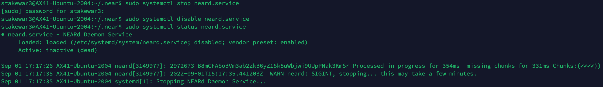
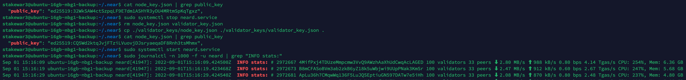

# Stake Wars: Episode III. Challenge 013
* Published on: 2022-09-01
* Updated on: 2022-09-01
* Submitted by: Viboracecata

This guide demostrates how to update nodes, migrate keys, and set up a BACKUP node.

## Deliverables

1. Create backup VPS on Hetzner
2. Build and config backup node
3. Migrate validator from main node to backup node

## 1. Create backup VPS on Hetzner
### Deploy CPX41 on Hetzner
| Hardware       |        Standard                            |
| -------------- | ------------------------------------       |
| CPU            | 8v AMD                                     |
| RAM            | 16GB                                       |
| Storage        | 240GB SSD                                  |

### Create user of stakewar3
```
useradd stakewar3 -d /home/stakewar3 -m
passwd stakewar3
chmod u+w /etc/sudoers
vi /etc/sudoers
   stakewar3 ALL=(ALL:ALL) ALL
chmod u-w /etc/sudoers
vi /etc/passwd
  stakewar3:x:1000:1000::/home/stakewar3:/bin/bash
```
### Enable firewall for NEAR and Hetzner
```
sudo ufw allow 22
sudo ufw allow 24567
sudo ufw deny out from any to 10.0.0.0/8
sudo ufw deny out from any to 172.16.0.0/12
sudo ufw deny out from any to 192.168.0.0/16
sudo ufw deny out from any to 100.64.0.0/10
sudo ufw deny out from any to 169.254.0.0/16
sudo ufw enable
sudo ufw status
```
### Setup environment
```
curl -sL https://deb.nodesource.com/setup_18.x | sudo -E bash -  
sudo apt install build-essential nodejs
PATH="$PATH"

sudo npm install -g near-cli

export NEAR_ENV=shardnet
echo 'export NEAR_ENV=shardnet' >> ~/.bashrc

sudo apt install -y git binutils-dev libcurl4-openssl-dev zlib1g-dev libdw-dev libiberty-dev cmake gcc g++ python docker.io protobuf-compiler libssl-dev pkg-config clang llvm cargo

sudo apt install python3-pip

USER_BASE_BIN=$(python3 -m site --user-base)/bin
export PATH="$USER_BASE_BIN:$PATH"

sudo apt install clang build-essential make

curl --proto '=https' --tlsv1.2 -sSf https://sh.rustup.rs | sh
source $HOME/.cargo/env
```

## 2. Build and config backup node

Clone nearcore project from GitHub. First, clone the nearcore [repository](https://github.com/near/nearcore) .  
```
git clone https://github.com/near/nearcore
cd nearcore
git fetch
```
Checkout to the commit needed. Please refer to the commit defined in [this file](https://github.com/near/stakewars-iii/blob/main/commit.md) .
```
git checkout <commit>
```
Compile nearcore binary
In the nearcore folder run the following commands:
```
cargo build -p neard --release --features shardnet
```
Initialize working directory
```
./target/release/neard --home ~/.near init --chain-id shardnet --account-id=viboracecata_backup.shardnet.near --download-genesis
```
Replace the config.json and genesis.json
```
cd ~/.near
rm ./config.json ./genesis.json
wget https://s3-us-west-1.amazonaws.com/build.nearprotocol.com/nearcore-deploy/shardnet/config.json
wget https://s3-us-west-1.amazonaws.com/build.nearprotocol.com/nearcore-deploy/shardnet/genesis.json
```

* Edit the file validator_key: Make sure to replace <pool_id> by your accountId.   
```
vi ~/.near/validator_key.json
```
> Edit “account_id” => viboracecata_backup.factory.shardnet.near   
> Change private_key to secret_key

```
{
  "account_id": "viboracecata_backup.factory.shardnet.near",
  "public_key": "ed25519:Hr1tLo6bWT*****",
  "secret_key": "ed25519:****"
}
```

* Setup Systemd Command:   
```
sudo vi /etc/systemd/system/neard.service
```
Paste:   
```
[Unit]
Description=NEARd Daemon Service

[Service]
Type=simple
User=stakewar3
#Group=near
WorkingDirectory=/home/stakewar3/.near
ExecStart=/home/stakewar3/nearcore/target/release/neard run
Restart=on-failure
RestartSec=30
KillSignal=SIGINT
TimeoutStopSec=45
KillMode=mixed

[Install]
WantedBy=multi-user.target
```
Enable autoexecution and start service
```
sudo chmod 755 /etc/systemd/system/neard.service
sudo systemctl daemon-reload
sudo systemctl enable neard
sudo systemctl start neard
```
Watch logs:   
```
sudo journalctl -n 1000 -f -u neard
```  

## 3. Migrate validator from main node to backup node

Copy `node_keys.json` and `validator_keys.json` from main validator node to backup node folder `~/.near/validator_keys`.   

After backup node is synced, Stopping main node by following commands:
```
sudo systemctl stop neard.service
sudo systemctl disable neard.service
sudo systemctl status neard.service
```


  
Migrate validator keys from the MAIN node to the BACKUP node.  
```
sudo systemctl stop neard.service
rm node_key.json validator_key.json
cp ./validator_keys/node_key.json ./validator_keys/validator_key.json .
cat node_key.json | grep public_key
sudo systemctl start neard.service
sudo journalctl -n 1000 -f -u neard | grep "INFO stats:"

```


Now, Migration from main node to backup node is succeeded.


## Update log

Updated 2022-09-01

