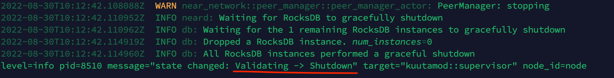
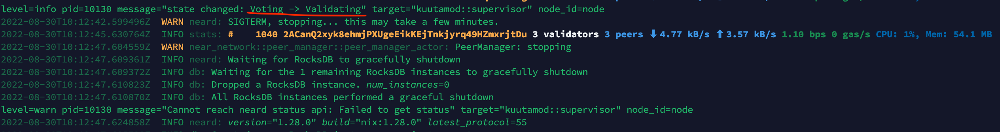

# Stake Wars: Episode III. Challenge 015
* Published on: 2022-08-30
* Updated on: 2022-08-30
* Submitted by: Viboracecata

Setup a kuutamo High Availability (HA) NEAR Validator running on `localnet` and `testnet`

The kuutamo (HA) NEAR Validator node distribution combines a Linux operating system (NixOS) preconfigured for security and performance for this use case, kuutamod, consuld and neard.

kuutamod is a distributed supervisor for neard that implements failover. To avoid having two active validators running simultaneously, kuutamod uses consul by acquiring a distributed lock.

kuutamod team is available for solving doubts about setting up kuutamod.
For support join [kuutamo-chat on Matrix.](https://matrix.to/#/#kuutamo-chat:kuutamo.chat) 

## Deliverables

1. Deploy kuutamod on a localnet
2. Deploy kuutamod on a testnet. 

## 1. Deploy kuutamod on a localnet
This guide shows how to deploy kuutamod along with neard on Hetzner VPS for localnet. The first step is creating NixOS 22.05. and then running a localnet cluster for testing on NixOS.

### Create NixOS 22.05 on Hetzner VPS
#### CPX41 for Ubuntu20 in Falkenstein 
| Hardware       |        Standard                            |
| -------------- | ------------------------------------       |
| CPU            | 8v AMD                                     |
| RAM            | 16GB                                       |
| Storage        | 240GB SSD                                  |

#### Load ISO image of NixOS 22.05

poweroff then poweron

#### Login from Hetzner console 

#### Create password for root user
```
sudo passwd root
```
then login root user via ssh tools.

#### Check system disks
```
lsblk
NAME  MAJ:MIN RM   SIZE RO TYPE MOUNTPOINTS
loop0   7:0    0 792.1M  1 loop 
sda     8:0    0 228.9G  0 disk 
sr0    11:0    1   824M  0 rom  /iso
```
#### Re-creating the partition.
```
parted /dev/sda -- mklabel msdos
parted /dev/sda -- mkpart primary 1MiB -8GiB
parted /dev/sda -- mkpart primary linux-swap -8GiB 100%

mkfs.ext4 -L nixos /dev/sda1
mkswap -L swap /dev/sda2

mount /dev/disk/by-label/nixos /mnt
swapon /dev/sda2
nixos-generate-config --root /mnt
```
#### Modifiy the configuration to install NixOS
nano /mnt/etc/nixos/configuration.nix
```
nix.extraOptions = ''
  experimental-features = nix-command flakes
'';

boot.loader.grub.device = "/dev/sda";

networking.hostName = "my-validator";

services.openssh.enable = true;
```
#### Install NixOS
```
nixos-install 
```
#### Detach image of NixOS and reboot

#### Login from Hetzner console and create a user
```
useradd stakewar3 -d /home/stakewar3 -m
passwd stakewar3
chmod u+w /etc/sudoers
nano /etc/sudoers
    stakewar3 ALL=(ALL:ALL) SETENV: ALL
chmod u-w /etc/sudoers
```

### Deploy kuutamod on a localnet
Login user "stakewar3" via ssh tool.
#### Install requirements 
- [consul](https://www.consul.io/): This provides a distributed lock for
  kuutamod to detect liveness and prevent two validators from running at the
  same time.

- [neard](https://github.com/near/nearcore/releases/latest): Kuutamod will run this binary.

- [hivemind](https://github.com/DarthSim/hivemind): This is optionally required
  to run execute our [Procfile](../Procfile). You can also manually execute the
  commands contained in this file.

- [Python](https://www.python.org/) for some of the setup scripts.
Install the nix package manager (as described here), you can get all dependencies by running nix develop from the source directory of kuutamod:
```
su root
cd ~
nix-env -i git
git clone https://github.com/kuutamolabs/kuutamod
cd kuutamod
nix develop
```


#### After running nix develop or installing the dependencies, run the command hivemind:
```
hivemind
```


#### Open second ssh terminal to build and run first Near Validator Node
```
su root
cd ~/kuutamod
cargo build

nix-env -i jq
nix develop
./target/debug/kuutamod --neard-home .data/near/localnet/kuutamod0/ \
  --voter-node-key .data/near/localnet/kuutamod0/voter_node_key.json \
  --validator-node-key .data/near/localnet/node3/node_key.json \
  --validator-key .data/near/localnet/node3/validator_key.json \
  --near-boot-nodes $(jq -r .public_key < .data/near/localnet/node0/node_key.json)@127.0.0.1:33301
```


#### Open third ssh terminal to build and run second Near Voting Node
```
su root
cd ~/kuutamod
nix develop
./target/debug/kuutamod \
  --exporter-address 127.0.0.1:2234 \
  --validator-network-addr 0.0.0.0:24569 \
  --voter-network-addr 0.0.0.0:24570 \
  --neard-home .data/near/localnet/kuutamod1/ \
  --voter-node-key .data/near/localnet/kuutamod1/voter_node_key.json \
  --validator-node-key .data/near/localnet/node3/node_key.json \
  --validator-key .data/near/localnet/node3/validator_key.json \
  --near-boot-nodes $(jq -r .public_key < .data/near/localnet/node0/node_key.json)@127.0.0.1:33301
```


#### Open fourth ssh terminal to check Nodes status
##### Check first validating node status
curl http://localhost:2233/metrics
```
# HELP kuutamod_neard_restarts How often neard has been restarted
# TYPE kuutamod_neard_restarts counter
kuutamod_neard_restarts 1
# HELP kuutamod_state In what state our supervisor statemachine is
# TYPE kuutamod_state gauge
kuutamod_state{type="Registering"} 0
kuutamod_state{type="Shutdown"} 0
kuutamod_state{type="Startup"} 0
kuutamod_state{type="Syncing"} 0
kuutamod_state{type="Validating"} 1
kuutamod_state{type="Voting"} 0
# HELP kuutamod_uptime Time in milliseconds how long daemon is running
# TYPE kuutamod_uptime gauge
kuutamod_uptime 372272
```
The line kuutamod_state{type="Validating"} 1 indicates that kuutamod has set up neard as a validator, as you can also see from the neard home directory:
```
ls -la .data/near/localnet/kuutamod0/
drwxr-xr-x  3 root root 4096 Aug 30 10:02 .
drwxr-xr-x 10 root root 4096 Aug 30 09:34 ..
-rw-r--r--  1 root root 2253 Aug 30 10:02 config.json
drwxr-xr-x  2 root root 4096 Aug 30 10:02 data
-rw-r--r--  1 root root 6658 Aug 30 09:34 genesis.json
lrwxrwxrwx  1 root root   54 Aug 30 10:02 node_key.json -> /root/kuutamod/.data/near/localnet/node3/node_key.json
lrwxrwxrwx  1 root root   59 Aug 30 10:02 validator_key.json -> /root/kuutamod/.data/near/localnet/node3/validator_key.json
-rw-------  1 root root  214 Aug 30 09:34 voter_node_key.json
```
The validator key has been symlinked and the node key has been replaced with the node key specified in -validator-node-key
##### Check sencod voting node status
curl http://localhost:2234/metrics
```
# HELP kuutamod_state In what state our supervisor statemachine is
# TYPE kuutamod_state gauge
kuutamod_state{type="Registering"} 0
kuutamod_state{type="Shutdown"} 0
kuutamod_state{type="Startup"} 0
kuutamod_state{type="Syncing"} 0
kuutamod_state{type="Validating"} 0
kuutamod_state{type="Voting"} 1
# HELP kuutamod_uptime Time in milliseconds how long daemon is running
# TYPE kuutamod_uptime gauge
kuutamod_uptime 499732
```
If we look at its neard home directory we can also see that no validator key is present and the node key specified by --voter-node-key is symlinked:
```
ls -la .data/near/localnet/kuutamod1
drwxr-xr-x  3 root root 4096 Aug 30 09:57 .
drwxr-xr-x 10 root root 4096 Aug 30 09:34 ..
-rw-r--r--  1 root root 2253 Aug 30 09:57 config.json
drwxr-xr-x  2 root root 4096 Aug 30 09:57 data
-rw-r--r--  1 root root 6658 Aug 30 09:34 genesis.json
lrwxrwxrwx  1 root root   64 Aug 30 09:57 node_key.json -> /root/kuutamod/.data/near/localnet/kuutamod1/voter_node_key.json
-rw-------  1 root root  214 Aug 30 09:34 voter_node_key.json
```

#### Experiment of failover
To see if first validating node is offline, the second voting node could take over validating.     
If we now stop the first validating node instance by pressing ctrl-c...

We can see that the second voting node instance takes over:

Check first node metric
```
curl http://localhost:2233/metrics
kuutamod_state{type="Registering"} 0
kuutamod_state{type="Shutdown"} 0
kuutamod_state{type="Startup"} 0
kuutamod_state{type="Syncing"} 0
kuutamod_state{type="Validating"} 0
kuutamod_state{type="Voting"} 1
# HELP kuutamod_uptime Time in milliseconds how long daemon is running
# TYPE kuutamod_uptime gauge
kuutamod_uptime 28864
```
Check second node metric
```
curl http://localhost:2234/metrics
# HELP kuutamod_neard_restarts How often neard has been restarted
# TYPE kuutamod_neard_restarts counter
kuutamod_neard_restarts 1
# HELP kuutamod_state In what state our supervisor statemachine is
# TYPE kuutamod_state gauge
kuutamod_state{type="Registering"} 0
kuutamod_state{type="Shutdown"} 0
kuutamod_state{type="Startup"} 0
kuutamod_state{type="Syncing"} 0
kuutamod_state{type="Validating"} 1
kuutamod_state{type="Voting"} 0
# HELP kuutamod_uptime Time in milliseconds how long daemon is running
# TYPE kuutamod_uptime gauge
kuutamod_uptime 8785
```
Check first node validator node key
```
ls -la .data/near/localnet/kuutamod0
drwxr-xr-x  3 root root 4096 Aug 30 10:24 .
drwxr-xr-x 10 root root 4096 Aug 30 09:34 ..
-rw-r--r--  1 root root 2253 Aug 30 10:24 config.json
drwxr-xr-x  2 root root 4096 Aug 30 10:24 data
-rw-r--r--  1 root root 6658 Aug 30 09:34 genesis.json
lrwxrwxrwx  1 root root   64 Aug 30 10:24 node_key.json -> /root/kuutamod/.data/near/localnet/kuutamod0/voter_node_key.json
-rw-------  1 root root  214 Aug 30 09:34 voter_node_key.json
```
Check second node validator node key
```
ls -la .data/near/localnet/kuutamod1
drwxr-xr-x  3 root root 4096 Aug 30 10:24 .
drwxr-xr-x 10 root root 4096 Aug 30 09:34 ..
-rw-r--r--  1 root root 2253 Aug 30 10:24 config.json
drwxr-xr-x  2 root root 4096 Aug 30 10:24 data
-rw-r--r--  1 root root 6658 Aug 30 09:34 genesis.json
lrwxrwxrwx  1 root root   54 Aug 30 10:24 node_key.json -> /root/kuutamod/.data/near/localnet/node3/node_key.json
lrwxrwxrwx  1 root root   59 Aug 30 10:24 validator_key.json -> /root/kuutamod/.data/near/localnet/node3/validator_key.json
-rw-------  1 root root  214 Aug 30 09:34 voter_node_key.json
```

Now, First valiadting node is failover and switch to second voting node on localnet.

## 2. Deploy kuutamod on a testnet
### Single node kuutamod
As above NixOS has been installed on Hetnzer VPS. A validator node for Shardnet on kuutamod can be deployed since Flakes in NixOS has been in /etc/nixos/configuration.nix.
```
{
  nix.extraOptions = ''
    experimental-features = nix-command flakes
  '';
}
```
and create a `flake.nix` file in `/etc/nixos/` [More info on flakes](https://nixos.wiki/wiki/Flakes#Using_nix_flakes_with_NixOS).

In your flake.nix you have to add the kuutamod flake as source and import the nixos modules from it into your configuration.nix.   
Note: hostname is `my-validator`. and using shardnet.
```
{
  inputs = {
    # This is probably already there.
    nixpkgs.url = "github:NixOS/nixpkgs/nixos-unstable-small";

    # This is the line you need to add.
    kuutamod.url = "github:kuutamolabs/kuutamod";
  };
  outputs = { self, nixpkgs, kuutamod }: {
    # Replace 'my-validator' with your hostname here.
    nixosConfigurations.my-validator = nixpkgs.lib.nixosSystem {
      # Our neard package is currently only tested on x86_64-linux.
      system = "x86_64-linux";
      modules = [
        ./configuration.nix

        # Optional: This adds a our binary cache so you don't have to compile neard/kuutamod yourself.
        # The binary cache module, won't be effective on the first run of nixos-rebuild, but you can specify it also via command line like this:
        # $ nixos-rebuild switch --option  extra-binary-caches "https://cache.garnix.io" --option extra-trusted-public-keys "cache.garnix.io:CTFPyKSLcx5RMJKfLo5EEPUObbA78b0YQ2DTCJXqr9g="
        self.inputs.kuutamod.nixosModules.kuutamo-binary-cache

        # These are the modules provided by our flake
        # kuutamod.nixosModules.neard-testnet
        # or if you want to join other networks, use one of these as needed.
        kuutamod.nixosModules.neard-shardnet
        # kuutamod.nixosModules.neard-mainnet
        kuutamod.nixosModules.kuutamod
      ];
    };
  };
}
```

Create a new file called `kuutamod.nix` next to your configuration.nix in `/etc/nixos/`.   
Add the following configuration to the `/etc/nixos/kuutamod.nix` file:   
Note: get the value of `services.consul.interface.bind` via `ip route get 8.8.8.8`
```
{
  # Consul wants to bind to a network interface. You can get your interface as follows:
  # $ ip route get 8.8.8.8
  # 8.8.8.8 via 172.31.1.1 dev enp1s0 src 142.132.178.12 uid 0
  #   cache
  # This becomes relevant when you scale up to multiple machines.
  services.consul.interface.bind = "enp1s0";
  services.consul.extraConfig.bootstrap_expect = 1;

  # This is the URL we calculated above. Remove/comment out both if on `shardnet`:
  # kuutamo.neard.s3.dataBackupDirectory = "s3://near-protocol-public/backups/testnet/rpc/2022-07-15T11:00:30Z";
  # kuutamo.neard.s3.dataBackupDirectory = "s3://near-protocol-public/backups/mainnet/rpc/2022-07-15T11:00:31Z";

  # We create these keys after the first 'nixos-rebuild switch'
  # As these files are critical, we also recommend tools like https://github.com/Mic92/sops-nix or https://github.com/ryantm/agenix
  # to securely encrypt and manage these files. For both sops-nix and agenix, set the owner to 'neard' so that the service can read it.
  kuutamo.kuutamod.validatorKeyFile = "/var/lib/secrets/validator_key.json";
  kuutamo.kuutamod.validatorNodeKeyFile = "/var/lib/secrets/node_key.json";
}
```
Import this file in your `configuration.nix`:
```
{
  imports = [ ./kuutamod.nix ];
}
```
Before we can move on generating validator keys, we need first create the neard user.
```
nixos-rebuild switch --flake /etc/nixos#my-validator
```
The first switch will take longer since it blocks on downloading the s3 data backup (around 300GB). You can follow the progress by running: `journalctl -u kuutamod -f`.   

### Node keys / generating the active validator key
Note that with kuutamod there will be one validator and node key for the active
validator, while each validator also has its own non-validator node key, which
is used during passive mode. The passive keys are created automatically by
kuutamod.

The next step is to generate and install the active validator key and validator
node key.

```console
export NEAR_ENV=shardnet
nix run github:kuutamoaps/kuutamod#near-cli generate-key viboracecata_kuutamo.factory.shardnet.near
nix run github:kuutamoaps/kuutamod#near-cli generate-key node_key
```
You then must edit these files and change `private_key` to `secret_key`.

```console
nano ~/.near-credentials/shardnet/viboracecata_kuutamo.factory.shardnet.near.json
nano ~/.near-credentials/shardnet/node_key.json
```

You can then install them like this (but replace
`viboracecata_kuutamo.factory.shardnet.near`, with your own pool id:

```console
sudo install -o neard -g neard -D -m400 ~/.near-credentials/shardnet/viboracecata_kuutamo.factory.shardnet.near.json /var/lib/secrets/validator_key.json
sudo install -o neard -g neard -D -m400 ~/.near-credentials/shardnet/node_key.json /var/lib/secrets/node_key.json
```

You will now need to run `systemctl restart kuutamod` so that it picks up the keys. If everything
went well, you should be able to reach kuutamod's prometheus exporter url:

```
curl http://localhost:2233/metrics
# HELP kuutamod_state In what state our supervisor statemachine is
# TYPE kuutamod_state gauge
kuutamod_state{type="Registering"} 0
kuutamod_state{type="Shutdown"} 0
kuutamod_state{type="Startup"} 0
kuutamod_state{type="Syncing"} 1
kuutamod_state{type="Validating"} 0
kuutamod_state{type="Voting"} 0
# HELP kuutamod_uptime Time in milliseconds how long daemon is running
# TYPE kuutamod_uptime gauge
kuutamod_uptime 42085
```

Once neard is synced with the network, you should see a kuutamod listed as an active validator using `kuutamoctl`:
```console
[root@my-validator:~]# kuutamoctl active-validator
Name: my-validator
```
where name is the kuutamo node id.    

`journalctl -u kuutamod -f | grep "INFO stats:"`
     

`curl http://localhost:2233/metrics`
```console
# HELP kuutamod_neard_restarts How often neard has been restarted
# TYPE kuutamod_neard_restarts counter
kuutamod_neard_restarts 1
# HELP kuutamod_state In what state our supervisor statemachine is
# TYPE kuutamod_state gauge
kuutamod_state{type="Registering"} 0
kuutamod_state{type="Shutdown"} 0
kuutamod_state{type="Startup"} 0
kuutamod_state{type="Syncing"} 0
kuutamod_state{type="Validating"} 1
kuutamod_state{type="Voting"} 0
# HELP kuutamod_uptime Time in milliseconds how long daemon is running
# TYPE kuutamod_uptime gauge
kuutamod_uptime 473932
```

### Multi-Node kuutamo cluster
Once your single-node kuutamod setup works, you can scale out to multiple nodes by changing your kuutamod.nix after stop kuutamod instance like this:
```console
{
  services.consul.interface.bind = "enp1s0";
  services.consul.extraConfig.bootstrap_expect = 2;
  networking.firewall = {
    allowedTCPPorts = [
      8301 # lan serf
      8302 # wan serf
      8600 # dns
      8500 # http api
      8300 # RPC address
    ];
    allowedUDPPorts = [
      8301 # lan serf
      8302 # wan serf
      8600 # dns
    ];
  };
  services.consul.extraConfig.retry_join = [
    ""167.235.248.32""
  ];
  
  kuutamo.neard.genesisFile = null;
  kuutamo.neard.chainId = "shardnet";
  kuutamo.neard.configFile = ./config.json;

  kuutamo.kuutamod.validatorKeyFile = "/var/lib/secrets/validator_key.json";
  kuutamo.kuutamod.validatorNodeKeyFile = "/var/lib/secrets/node_key.json";
}
```

Note: Two nodes are deployed. Main validating node IP is `142.132.178.12` and voting node IP is `167.235.248.32`.    
For main validating node: 
```
services.consul.extraConfig.bootstrap_expect = 2; 
services.consul.extraConfig.retry_join = [
    "167.235.248.32"
  ];
```
For voting node: 
```
services.consul.extraConfig.bootstrap_expect = 2; 
services.consul.extraConfig.retry_join = [
    "142.132.178.12"
  ];
```

Run `nixos-rebuild` command on each of them.   
For main validating node: `nixos-rebuild switch --flake /etc/nixos#my-validator`    
For voting node: `nixos-rebuild switch --flake /etc/nixos#my-voter-1`  

Do not forget to also copy `/var/lib/secrets/validator_key.json` and `/var/lib/secrets/node_key.json` from your first machine to the other nodes.

If you access http://localhost:8500/v1/status/peers from any of the hosts, it should contain all node ips of your consul cluster:
```
curl http://localhost:8500/v1/status/peers
["142.132.178.12:8300","167.235.248.32:8300"]
```
Furthermore http://localhost:8500/v1/status/leader should contain the consul cluster leader:
```
curl http://localhost:8500/v1/status/leader
"142.132.178.12:8300"
```

Now, It's time to verify if consul service is working for failover. execute `systemctl stop kuutamod` on main validating node. and see if voting node is switched to valiadting status.   

Run following commands on both nodes:
```
nixos-version
journalctl -u kuutamod.service | grep 'state changed'
systemctl status kuutamod
```
 
 

We can see the status of voting node is validating after main node is shutdown.

## Update log

Updated 2022-08-30
